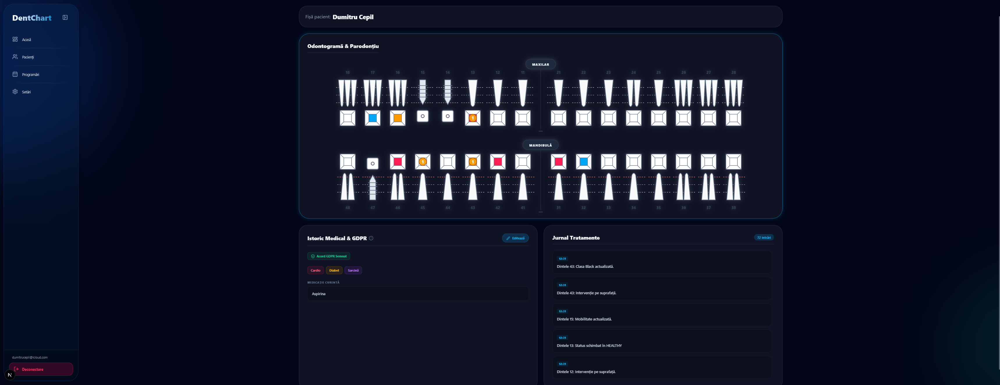
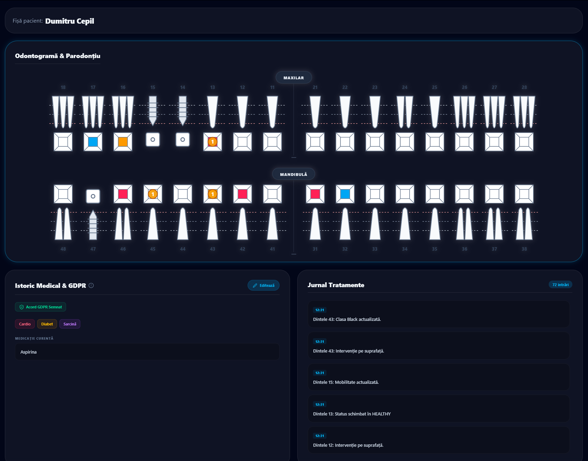
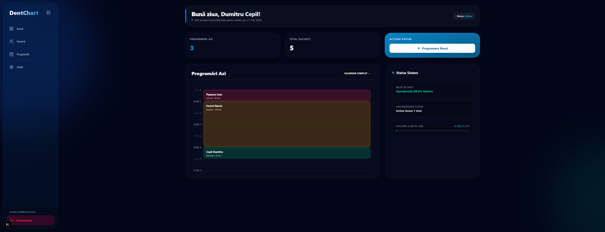
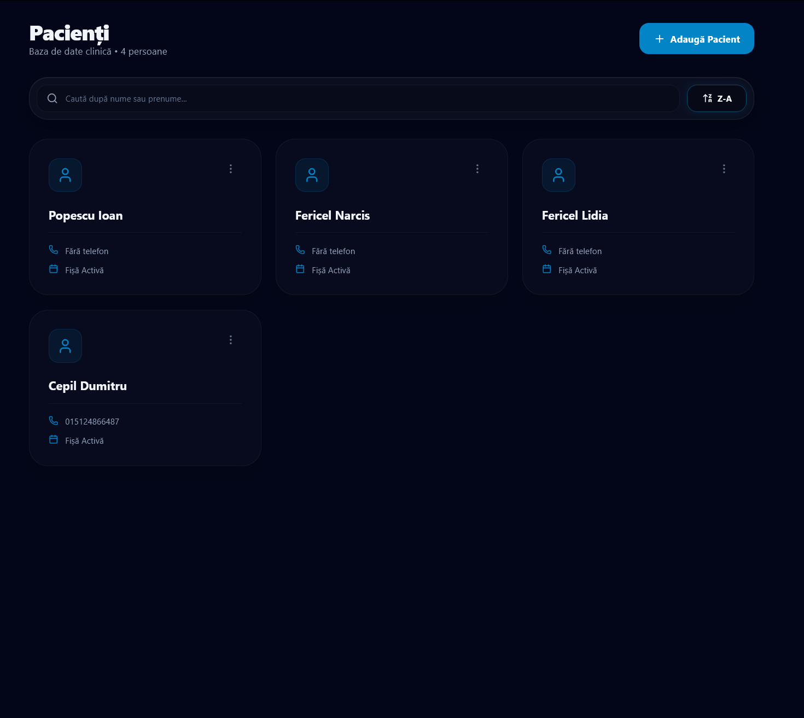
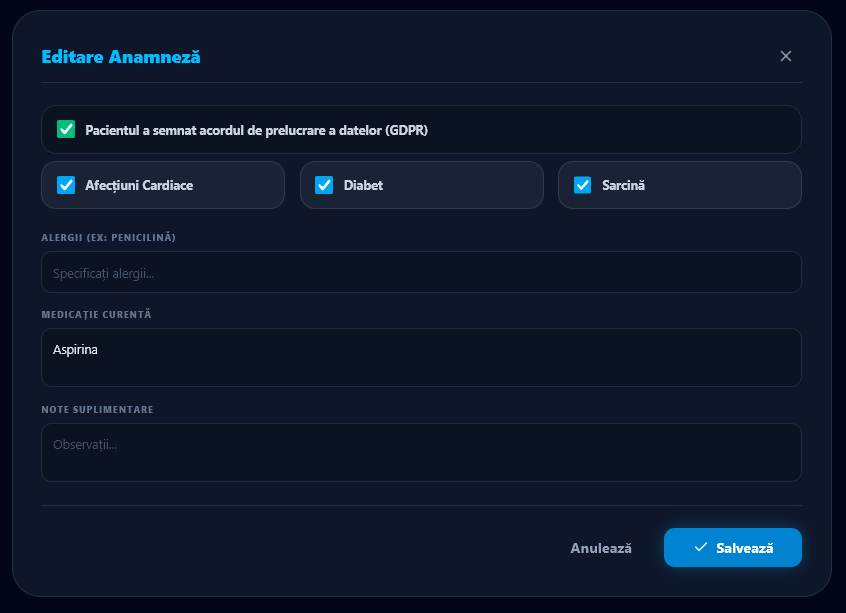
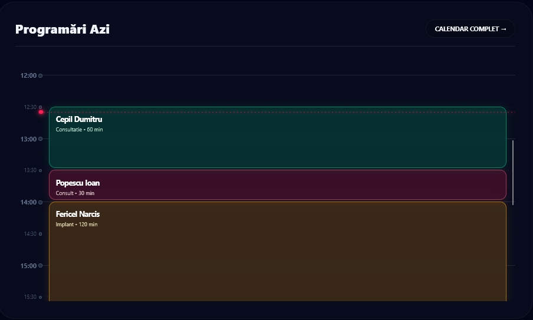

# DentChart
A web application designed to digitize dental workflows, integrating anamnesis, odontograms, and calendar management. Developed as a Computer Science thesis project.
**Live Demo:** [https://dentchart.vercel.app/](https://dentchart.vercel.app/)

DentChart is a comprehensive web application designed to digitize and optimize dental clinic workflows. Developed as a Computer Science thesis project in direct collaboration with a dental medicine student, the platform is tailored to meet the practical, day-to-day requirements of dental students and practitioners. 

It centralizes patient data, procedural tracking, and scheduling to reduce administrative overhead and transition traditional paper-based clinics into a unified digital environment.

---

## 🏗 Architecture Note: Live Demo vs. Production

* **Live Demo (Vercel):** The publicly accessible version is configured to use local state and mock data. This allows guests to freely explore all features, interact with the charting tools, and add/remove schedules without requiring user authentication or modifying a live production database.
* **Production Version:** The original, fully deployed application relies on a working backend hosted on **Supabase**, utilizing its PostgreSQL database and authentication services for secure, persistent data storage across multiple clinic users.

---

## ⚙️ Technical Stack

* **Framework:** Next.js
* **Language:** TypeScript
* **Styling:** Tailwind CSS
* **Graphics:** Custom SVG rendering (utilized for the highly interactive, individual tooth components in the Odontogram)
* **Backend (Production):** Supabase

---

## ✨ Core Features & Visual Walkthrough

### 1. Interactive Dental & Periodontal Charting (Odontogram)
The core feature of the application is a custom-built, SVG-based interactive dental chart. It allows dentists to visually map past dental work, current pathologies (e.g., caries, mobility), and planned treatments on specific tooth surfaces. It also integrates periodontal tracking.


*Detailed view of the interactive SVG odontogram and treatment journal.*



### 2. Clinic Dashboard
A centralized hub providing a quick overview of the day's operations, including total patient count, upcoming appointments, and system status.



### 3. Patient Management 
A searchable database for all registered clinic patients, providing quick access to their individual files, contact information, and treatment history.



### 4. Medical History & GDPR Compliance (Anamnesis)
Integrated digital forms for capturing and updating patient medical backgrounds, alerting the dentist to specific conditions (e.g., cardiac issues, diabetes, pregnancy), current medications, and tracking GDPR consent signatures.



### 5. Calendar & Scheduling
A visual timeline and appointment management system. Users can easily add, edit, or remove consultations and procedures, providing a clear overview of the daily clinical workflow.



---

## 🚀 Local Development

To run this project locally on your machine:

1. Clone the repository:
   ```bash
   git clone [https://github.com/dumcep/DentChart-CodeBase.git](https://github.com/dumcep/DentChart-CodeBase.git)
